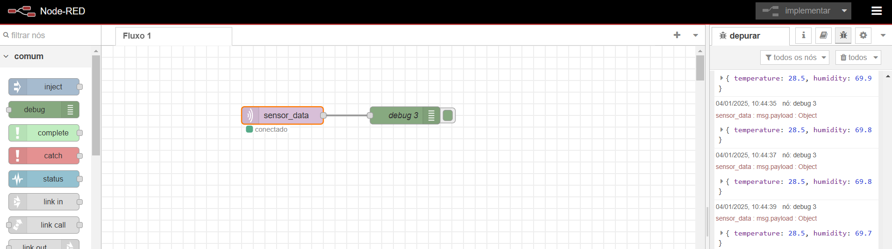

# Publicação de mensagens em um Broker MQTT

- OBS: o primeiro código abaixo foi usando apenas o sensor de temperatura da ESP32.

## Mosquitto e Node-Red

- Como estamos trabalhando com o protocolo MQTT foi usando o Broker Mosquitto. Iniciamente instalamos o Mosquitto em minha máquina local. Esse Broker vai servir como intermediador das mensagens que a ESP32 estará publicando no tópico "sensor_data".
- Além disso para conseguimos visualizar essas informações de forma WEB instalei em minha máquina local o Node-Red e nele fiz a configuração do Broker Mosquitto, que é basicamente um apontamenteo para o IP da minha máquina. Com isso, conseguir receber no Node-Red as informações de temperatura e umidade provenientes do sensor DHT22.

### Código

- O código apresentado abaixo foi implementado na placa ESP e validado seu funcionamento. 
- Esse programa faz tanto a conexão da ESP32 no Wifi quando a coenxão com o Broker Mosquitto e a assinatura ao tópico "sensor_data" onde será publicado as informações do sensor DHT22.

```arduino
#include <WiFi.h>
#include <PubSubClient.h>
#include <DHT.h>

// Configurações do DHT22
#define DHTPIN 4       // GPIO do sensor
#define DHTTYPE DHT22  // Tipo de sensor
DHT dht(DHTPIN, DHTTYPE);

// Configurações de WiFi
const char* ssid = "Fabio";
const char* password = "F0023339";

// Configurações do MQTT (Mosquitto)
const char* mqttServer = "192.168.2.124"; // Substitua pelo IP do seu broker
const int mqttPort = 1883;                // Porta padrão MQTT
const char* mqttUser = "";                // Deixe vazio se o Mosquitto não exigir autenticação
const char* mqttPassword = "";            // Deixe vazio se não exigir senha
const char* mqttTopic = "sensor_data";    // Tópico para publicação

// Variáveis globais
WiFiClient espClient;
PubSubClient mqttClient(espClient);
float temperature = 0.0;
float humidity = 0.0;

// Controle de tempo
unsigned long lastPublishTime = 0; // Armazena o tempo da última publicação
const unsigned long publishInterval = 2000; // Intervalo de 2 segundos

/* Função para conectar ao WiFi */
void connectToWiFi() {
  Serial.print("Conectando ao WiFi: ");
  Serial.println(ssid);
  WiFi.begin(ssid, password);
  while (WiFi.status() != WL_CONNECTED) {
    Serial.print(".");
    delay(500);
  }
  Serial.println("\nConectado ao WiFi!");
}

/* Função para conectar ao broker MQTT */
void connectToMQTT() {
  mqttClient.setServer(mqttServer, mqttPort);
  while (!mqttClient.connected()) {
    Serial.print("Conectando ao broker MQTT...");
    if (mqttClient.connect("ESP32Client", mqttUser, mqttPassword)) {
      Serial.println("Conectado!");
    } else {
      Serial.print("Falha na conexão, rc=");
      Serial.print(mqttClient.state());
      Serial.println(" Tentando novamente em 5 segundos...");
      delay(5000);
    }
  }
}

/* Função para publicar dados no broker MQTT */
void publishToMQTT() {
  char message[50];
  snprintf(message, sizeof(message), "{\"temperature\":%.2f,\"humidity\":%.2f}", temperature, humidity);

  if (mqttClient.publish(mqttTopic, message)) {
    Serial.println("Dados publicados no MQTT:");
    Serial.println(message);
  } else {
    Serial.println("Falha ao publicar os dados no MQTT");
  }
}

/* Setup - executado uma vez */
void setup() {
  Serial.begin(115200);

  // Inicializa o sensor DHT22
  dht.begin();

  // Conecta ao WiFi
  connectToWiFi();

  // Conecta ao broker MQTT
  connectToMQTT();
}

/* Loop principal */
void loop() {
  if (!mqttClient.connected()) {
    connectToMQTT();
  }
  mqttClient.loop();

  // Verifica se já passou o intervalo de tempo para publicar
  unsigned long currentTime = millis();
  if (currentTime - lastPublishTime >= publishInterval) {
    temperature = dht.readTemperature(); // Lê a temperatura em °C
    humidity = dht.readHumidity();       // Lê a umidade relativa em %

    if (isnan(temperature) || isnan(humidity)) {
      Serial.println("Falha na leitura do sensor DHT22!");
    } else {
      publishToMQTT();
    }

    lastPublishTime = currentTime; // Atualiza o tempo da última publicação
  }

  delay(100); // Pequeno atraso para evitar loops muito rápidos
}
```
### Evidências


# Publicando informações dos sensores DHT22 e LDR para o Broker Mosquitto

- Após a configuração e instalação do LDR + ADS1115 na ESP32, foi ajustado o código para ter o envio tando do sensor de temperatura quanto o de luminosidade para o broker MQTT e assim foi possível ter a informação recebida em 2 tópicos no Node-red.

### Código modificado 

```Arduino
#include <WiFi.h>
#include <PubSubClient.h>
#include <DHT.h>
#include <Wire.h>
#include <Adafruit_ADS1X15.h>

// Configurações do DHT22
#define DHTPIN 4       // GPIO do sensor
#define DHTTYPE DHT22  // Tipo de sensor
DHT dht(DHTPIN, DHTTYPE);

// Criar um objeto para o ADS1115
Adafruit_ADS1115 ads;

// Configurações de WiFi
const char* ssid = "Fabio";
const char* password = "F0023339";

// Configurações do MQTT (Mosquitto)
const char* mqttServer = "192.168.2.124"; // Substitua pelo IP do seu broker
const int mqttPort = 1883;                // Porta padrão MQTT
const char* mqttUser = "";                // Deixe vazio se o Mosquitto não exigir autenticação
const char* mqttPassword = "";            // Deixe vazio se não exigir senha
const char* mqttTempTopic = "sensor_temp"; // Tópico para publicar temperatura e umidade
const char* mqttLdrTopic = "sensor_lux";        // Tópico para publicar o sensor de luz LDR

// Variáveis globais
WiFiClient espClient;
PubSubClient mqttClient(espClient);
float temperature = 0.0;
float humidity = 0.0;
int16_t ldrValue = 0; // Valor do sensor LDR

// Controle de tempo
unsigned long lastPublishTime = 0; // Armazena o tempo da última publicação
const unsigned long publishInterval = 2000; // Intervalo de 2 segundos

/* Função para conectar ao WiFi */
void connectToWiFi() {
  Serial.print("Conectando ao WiFi: ");
  Serial.println(ssid);
  WiFi.begin(ssid, password);
  while (WiFi.status() != WL_CONNECTED) {
    Serial.print(".");
    delay(500);
  }
  Serial.println("\nConectado ao WiFi!");
}

/* Função para conectar ao broker MQTT */
void connectToMQTT() {
  mqttClient.setServer(mqttServer, mqttPort);
  while (!mqttClient.connected()) {
    Serial.print("Conectando ao broker MQTT...");
    if (mqttClient.connect("ESP32Client", mqttUser, mqttPassword)) {
      Serial.println("Conectado!");
    } else {
      Serial.print("Falha na conexão, rc=");
      Serial.print(mqttClient.state());
      Serial.println(" Tentando novamente em 5 segundos...");
      delay(5000);
    }
  }
}

/* Função para publicar dados no broker MQTT */
void publishToMQTT() {
  // Publicando dados de temperatura e umidade
  char message[50];
  snprintf(message, sizeof(message), "{\"temperature\":%.2f,\"humidity\":%.2f}", temperature, humidity);
  if (mqttClient.publish(mqttTempTopic, message)) {
    Serial.println("Dados de temperatura e umidade publicados no MQTT:");
    Serial.println(message);
  } else {
    Serial.println("Falha ao publicar os dados de temperatura e umidade no MQTT");
  }

  // Publicando o estado da luz baseado no valor do LDR
  String lightStatus = (ldrValue > 14500) ? "Lâmpada APAGADA" : "Lâmpada ACESA";
  snprintf(message, sizeof(message), "{\"ldrStatus\":\"%s\"}", lightStatus.c_str());
  if (mqttClient.publish(mqttLdrTopic, message)) {
    Serial.println("Estado da luz (LDR) publicado no MQTT:");
    Serial.println(message);
  } else {
    Serial.println("Falha ao publicar o estado da luz (LDR) no MQTT");
  }
}

/* Setup - executado uma vez */
void setup() {
  Serial.begin(115200);

  // Inicializa o sensor DHT22
  dht.begin();

  // Inicializa o ADS1115 no endereço (0x49) porque o ADDR está conectado ao VCC
  Wire.begin(21, 22);  // SDA no GPIO21 e SCL no GPIO22
  if (!ads.begin(0x49)) {
    Serial.println("Falha ao inicializar o ADS1115!");
    while (1);
  }
  Serial.println("ADS1115 inicializado com sucesso.");

  // Conecta ao WiFi
  connectToWiFi();

  // Conecta ao broker MQTT
  connectToMQTT();
}

/* Loop principal */
void loop() {
  if (!mqttClient.connected()) {
    connectToMQTT();
  }
  mqttClient.loop();

  // Verifica se já passou o intervalo de tempo para publicar
  unsigned long currentTime = millis();
  if (currentTime - lastPublishTime >= publishInterval) {
    temperature = dht.readTemperature(); // Lê a temperatura em °C
    humidity = dht.readHumidity();       // Lê a umidade relativa em %

    // Lê o valor do sensor LDR (canal A0)
    ldrValue = ads.readADC_SingleEnded(3);  // Lê o valor do canal A3 do ADS1115

    if (isnan(temperature) || isnan(humidity)) {
      Serial.println("Falha na leitura do sensor DHT22!");
    } else {
      publishToMQTT(); // Publica os dados de temperatura, umidade e LDR
    }

    lastPublishTime = currentTime; // Atualiza o tempo da última publicação
  }

  delay(100); // Pequeno atraso para evitar loops muito rápidos
}
```

### Evidência do funcionamento no Node-red:


_OBS: aparece a mensagem de "lampada apagada" justamente quando coloquei a mão sobre o sensor LDR._

### Código - versão com tópicos para cada valor (temperatura, umidade e luz)

```Arduino
#include <WiFi.h>
#include <PubSubClient.h>
#include <DHT.h>
#include <Wire.h>
#include <Adafruit_ADS1X15.h>

// Configurações do DHT22
#define DHTPIN 4       // GPIO do sensor
#define DHTTYPE DHT22  // Tipo de sensor
DHT dht(DHTPIN, DHTTYPE);

// Criar um objeto para o ADS1115
Adafruit_ADS1115 ads;

// Configurações de WiFi
const char* ssid = "Fabio";
const char* password = "F0023339";

// Configurações do MQTT (Mosquitto)
const char* mqttServer = "192.168.2.124"; // Substitua pelo IP do seu broker
const int mqttPort = 1883;                // Porta padrão MQTT
const char* mqttUser = "";                // Deixe vazio se o Mosquitto não exigir autenticação
const char* mqttPassword = "";            // Deixe vazio se não exigir senha
const char* mqttTempTopic = "sensor_temp"; // Tópico para publicar temperatura
const char* mqttHumTopic = "sensor_umid"; // Tópico para publicar umidade
const char* mqttLdrTopic = "sensor_luz";        // Tópico para publicar o sensor de luz LDR

// Variáveis globais
WiFiClient espClient;
PubSubClient mqttClient(espClient);
float temperature = 0.0;
float humidity = 0.0;
int16_t ldrValue = 0; // Valor do sensor LDR

// Controle de tempo
unsigned long lastPublishTime = 0; // Armazena o tempo da última publicação
const unsigned long publishInterval = 2000; // Intervalo de 2 segundos

/* Função para conectar ao WiFi */
void connectToWiFi() {
  Serial.print("Conectando ao WiFi: ");
  Serial.println(ssid);
  WiFi.begin(ssid, password);
  while (WiFi.status() != WL_CONNECTED) {
    Serial.print(".");
    delay(500);
  }
  Serial.println("\nConectado ao WiFi!");
}

/* Função para conectar ao broker MQTT */
void connectToMQTT() {
  mqttClient.setServer(mqttServer, mqttPort);
  while (!mqttClient.connected()) {
    Serial.print("Conectando ao broker MQTT...");
    if (mqttClient.connect("ESP32Client", mqttUser, mqttPassword)) {
      Serial.println("Conectado!");
    } else {
      Serial.print("Falha na conexão, rc=");
      Serial.print(mqttClient.state());
      Serial.println(" Tentando novamente em 5 segundos...");
      delay(5000);
    }
  }
}

/* Função para publicar dados no broker MQTT */
void publishToMQTT() {
  // Publicando dados de temperatura
  char message[50];
  snprintf(message, sizeof(message), "%.2f", temperature);
  if (mqttClient.publish(mqttTempTopic, message)) {
    Serial.println("Temperatura publicada no MQTT:");
    Serial.println(message);
  } else {
    Serial.println("Falha ao publicar a temperatura no MQTT");
  }

  // Publicando dados de umidade
  snprintf(message, sizeof(message), "%.2f", humidity);
  if (mqttClient.publish(mqttHumTopic, message)) {
    Serial.println("Umidade publicada no MQTT:");
    Serial.println(message);
  } else {
    Serial.println("Falha ao publicar a umidade no MQTT");
  }

  // Publicando o estado da luz baseado no valor do LDR
  String lightStatus = (ldrValue > 14500) ? "Lâmpada APAGADA" : "Lâmpada ACESA";
  snprintf(message, sizeof(message), "{\"ldrStatus\":\"%s\"}", lightStatus.c_str());
  if (mqttClient.publish(mqttLdrTopic, message)) {
    Serial.println("Estado da luz (LDR) publicado no MQTT:");
    Serial.println(message);
  } else {
    Serial.println("Falha ao publicar o estado da luz (LDR) no MQTT");
  }
}

/* Setup - executado uma vez */
void setup() {
  Serial.begin(115200);

  // Inicializa o sensor DHT22
  dht.begin();

  // Inicializa o ADS1115 no endereço (0x49) porque o ADDR está conectado ao VCC
  Wire.begin(21, 22);  // SDA no GPIO21 e SCL no GPIO22
  if (!ads.begin(0x49)) {
    Serial.println("Falha ao inicializar o ADS1115!");
    while (1);
  }
  Serial.println("ADS1115 inicializado com sucesso.");

  // Conecta ao WiFi
  connectToWiFi();

  // Conecta ao broker MQTT
  connectToMQTT();
}

/* Loop principal */
void loop() {
  if (!mqttClient.connected()) {
    connectToMQTT();
  }
  mqttClient.loop();

  // Verifica se já passou o intervalo de tempo para publicar
  unsigned long currentTime = millis();
  if (currentTime - lastPublishTime >= publishInterval) {
    temperature = dht.readTemperature(); // Lê a temperatura em °C
    humidity = dht.readHumidity();       // Lê a umidade relativa em %

    // Lê o valor do sensor LDR (canal A0)
    ldrValue = ads.readADC_SingleEnded(3);  // Lê o valor do canal A3 do ADS1115

    if (isnan(temperature) || isnan(humidity)) {
      Serial.println("Falha na leitura do sensor DHT22!");
    } else {
      publishToMQTT(); // Publica os dados de temperatura, umidade e LDR
    }

    lastPublishTime = currentTime; // Atualiza o tempo da última publicação
  }

  delay(100); // Pequeno atraso para evitar loops muito rápidos
}

```