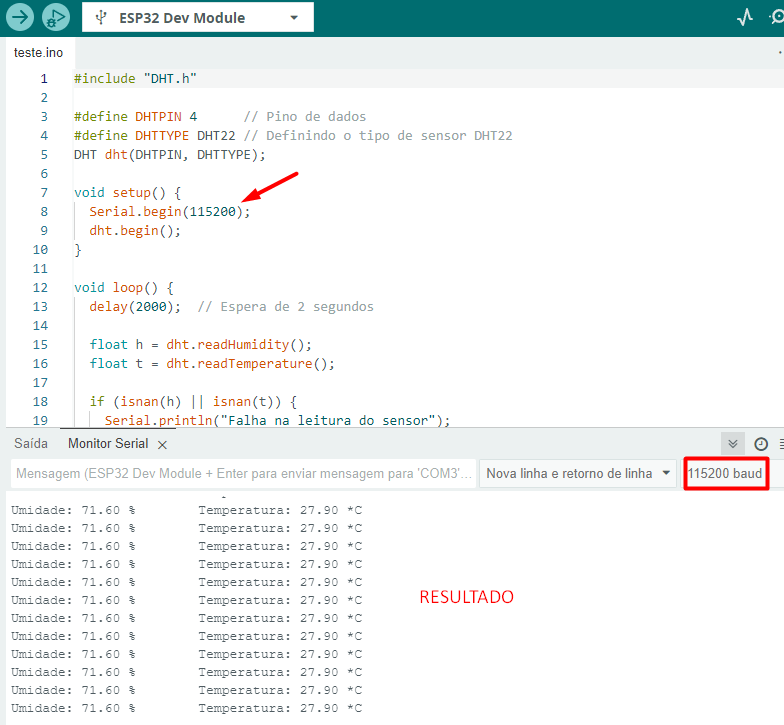

# Código de teste do sensor DHT22 na ESP32

Usando a IDE Arduino para programação da ESP32. 

- O código abaixo foi testado na prática e funciona corretamente, mostra no monitor Serial da própria IDE o valor lido pelo sensor.
- Para o funcionamento correto, o sensor DHT22 foi instalado fisicamente no D4 (pino 4 da ESP32), no 3v3 e no GND da esp.


```arduino
#include "DHT.h"

#define DHTPIN 4      // Pino de dados
#define DHTTYPE DHT22 // Definindo o tipo de sensor DHT22
DHT dht(DHTPIN, DHTTYPE);

void setup() {
  Serial.begin(115200);
  dht.begin();
}

void loop() {
  delay(2000);  // Espera de 2 segundos

  float h = dht.readHumidity();
  float t = dht.readTemperature();

  if (isnan(h) || isnan(t)) {
    Serial.println("Falha na leitura do sensor");
    return;
  }

  Serial.print("Umidade: ");
  Serial.print(h);
  Serial.print(" %\t");
  Serial.print("Temperatura: ");
  Serial.print(t);
  Serial.println(" *C");
}
```
Imagem de como aparece o resultado após o código está rodando na placa ESP32:



_OBS: é necessário que o "Serial.begin(115200)" do código tenha o mesmo valor que o monitor serial._
