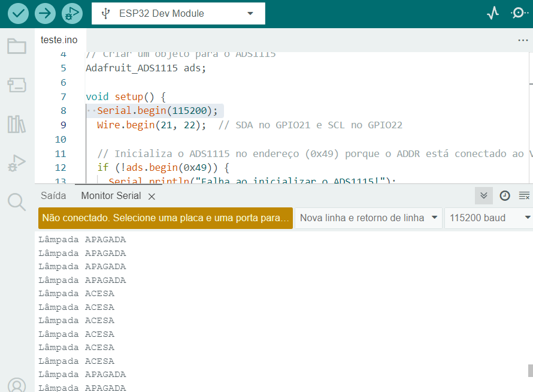

# Código de teste do sensor LDR em conjunto com ADS1115 na ESP32

Usando a IDE Arduino para programação da ESP32.

- O código abaixo foi testado na prática e funciona corretamente, mostra no monitor Serial da própria IDE a "interpretação" se está acesso ou apagado a luz.
- Para o funcionamento correto, o sensor LDR foi instalado fisicamente no A3 na placa ADS e o SCL e SDA do ADS foi conectado nos pinos D22 e D21 respectivamente. Além disso esse conversor de digital para analógico (ADS1115) foi alimentando por 3v.
- Outro detalhe é que como ja recebemos o ADS1115 com o ADDR jumpeado com o VCC, isso implica que o endereço I2C será **0x49**.

```Arduino
#include <Wire.h>
#include <Adafruit_ADS1X15.h>

// Criar um objeto para o ADS1115
Adafruit_ADS1115 ads;

void setup() {
  Serial.begin(115200);
  Wire.begin(21, 22);  // SDA no GPIO21 e SCL no GPIO22

  // Inicializa o ADS1115 no endereço (0x49) porque o ADDR está conectado ao VCC
  if (!ads.begin(0x49)) {
    Serial.println("Falha ao inicializar o ADS1115!");
    while (1);
  }
  Serial.println("ADS1115 inicializado com sucesso.");
}

void loop() {
  int16_t adc0 = ads.readADC_SingleEnded(3);  // Lê o valor do canal A0

  // Exemplo de lógica para verificar a lâmpada (ajustar o limiar conforme necessário)
  const int THRESHOLD = 10000;  // Ajuste conforme a calibração
  if (adc0 > THRESHOLD) {
    Serial.println("Lâmpada ACESA");
  } else {
    Serial.println("Lâmpada APAGADA");
  }

  delay(500);  // Aguardar 500ms antes da próxima leitura
}
```	

Abaixo, imagem que mostra o resultado do código no serial monitor da IDE.



_OBS: é necessário que o "Serial.begin(115200)" do código tenha o mesmo valor que o monitor serial._

